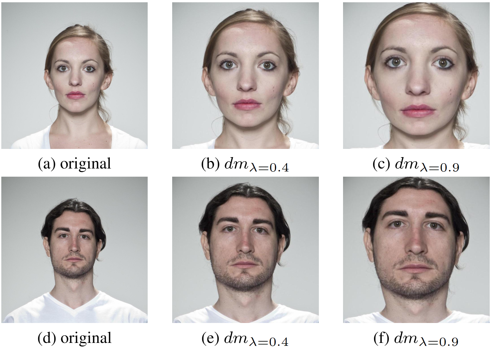

# Radial Distortion in Face Images: Detection and Impact

Radial distortion, also known as the fish-eye effect, is one of the main categories of camera distortions. It distorts the image, creating a hemispherical (panoramic) effect. The effect on facial images is shown in the example images below.

|  | 
|:--:| 
| Radial distortion effect in face images |

## Features

This project offers pretrained radial distortion detection models as well as radial distortion and face cropping transformations to create radially distorted image datasets for training. It supports various distortion models and allows for both fixed and random distortion intensities. The transformations can be applied in different sequences, such as distortion followed by face cropping or vice versa.

1. Use a pretrained radial distortion detection model for inference or as a FIQA algorithm.

2. Create radially distorted datasets with a chosen distortion model (`division`, `perspective`, `stereographic`, `equisolid`, `orthogonal`) and a chosen intensity value.

3. Apply face cropping to a dataset of face images and maintain a margin around the face in the cropped images with either one of three strategies:
   - Fixed: will add the same number of pixels on each side of the face.
   - LTRB: you can control the number of pixels on each side of the face.
   - Ratio: will add a number of pixels horizontally and vertically according to a ratio of the original image.

4. Apply face cropping `then` radial distortion.
   
5. Apply radial distortion `then` face cropping.

## How to Use

### Prerequisites

1. Create and activate a virtual environment.
   ```sh
    python3 -m venv .venv
    source .venv/bin/activate
    ```
2. Install `torch` and `torchvision`
3. Install the required dependencies:
    ```sh
    pip install -r requirements.txt
    ```
4. If you want to also use the trained distortion models for inference or as FIQA algorithm then install the extra dependencies:
    ```sh
    pip install -r requirements.fiqa.txt
    ```
5. If you want to use face cropping, set the `detector_path` in the file `src/conf/processor/face_crop/base.yaml` to the absolute path of the model `models/detector.tflite`.

### Transformations

#### Configuration

You can control all transformation tasks easily using configuration files. The YAML files located in the `src/conf/transformation/` are presets you can modify/copy to perform the desired task. For example:

- `0_distortion_fixed.yaml`: Applies radial distortion with a fixed lambda value.
- `0_distortion_random.yaml`: Applies radial distortion with a random lambda value.
- `1_facecrop_fixed.yaml`: Applies face cropping with a fixed number of pixels expansion.
- `2_distortion_then_facecrop.yaml`: Applies radial distortion followed by face cropping.
- `2_facecrop_then_distortion.yaml`: Applies face cropping followed by radial distortion.

Take a look at the description at the top of each file.

#### Running

Run the main script with the desired configuration file:
```sh
python src/main.py --config-name /transformation/[transformation_file].yaml    
```

Example: To apply a fixed radial distortion followed by face cropping, use the following command:
```sh
python src/main.py --config-name /transformation/2_distortion_then_facecrop.yaml]
```

### Radial Distortion Inference/FIQA

1. Download a model checkpoint:

    | Model    | Checkpoint |
    | -------- | ------- |
    | M1  | [Link](https://drive.google.com/file/d/1p9HyCtnJuX89WkrK8PKWBL-4GEnREDFb/view?usp=sharing)    |
    | M2  | [Link](https://drive.google.com/file/d/1Ofi3cSZB8GnNSk5mAdjKlftBelL6nSpz/view?usp=sharing)    |
    | M3  | [Link](https://drive.google.com/file/d/172domDw2Wh6dMoHiMz_mwFmrRR_t7Qm-/view?usp=sharing)    |

2. See example usage in `src/fiqa.py` where you need to set the path to the downloaded checkpoint and the input image.

## Citation

```bibtex
@INPROCEEDINGS{Kabbani-2024-IJCB-RADIAL-DISTORTION,
  author={Kabbani, Wassim and Raja, Kiran and Ramachandra, Raghavendra and Busch, Christoph},
  booktitle={International Joint Conference on Biometrics (IJCB)}, 
  title={Radial Distortion in Face Images: Detection and Impact}, 
  year={2024}
}
```